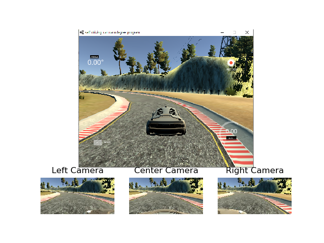
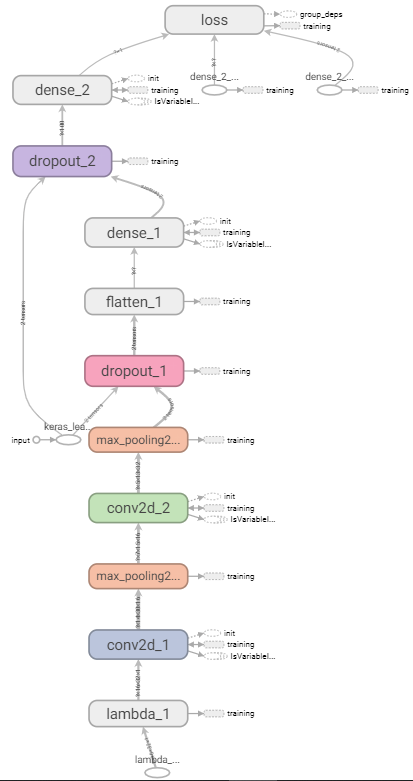
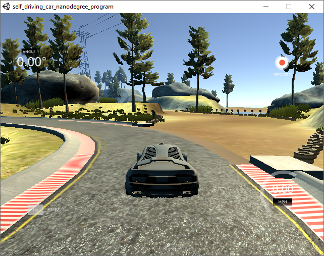
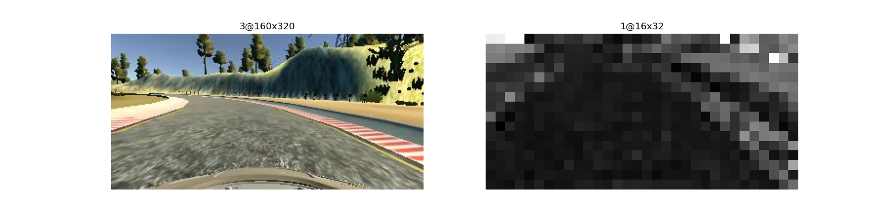
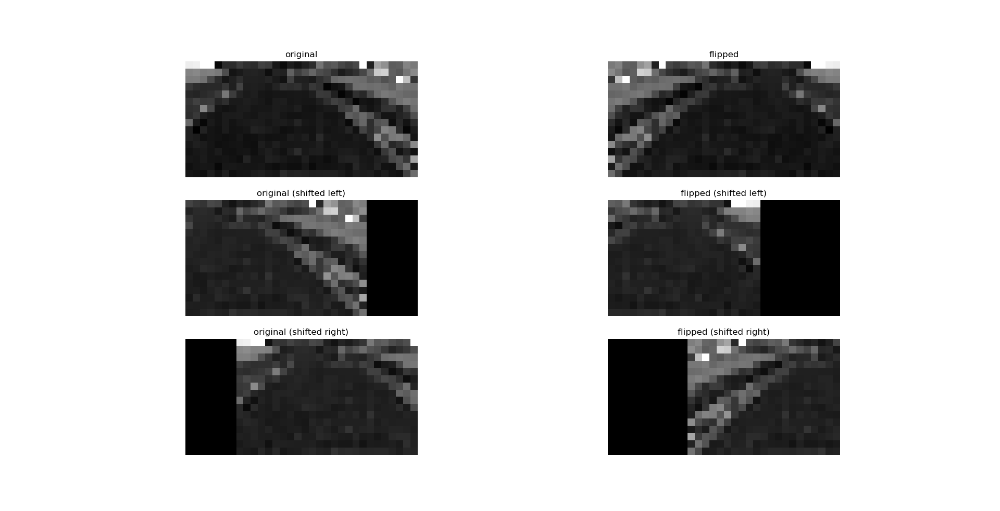

# Behavioral Cloning Project

[](http://www.udacity.com/drive)

This is a project for Udacity Self-Drving Car NanoDegree. The aim for this project is to control a car in a simulator using neural network. The implementation uses a convolutional neural network (CNN).

## Dependencies

- Simulator provided by Udacity contained in [CarND Term1 Starter Kit](https://github.com/udacity/CarND-Term1-Starter-Kit)

## How to run the project

1. Run the following command:

    ``` bash
    python drive.py model.h5
    ```
2. Open the simulator and select **"Autonomous Mode"**

## Project Setup

The simulator provides 2 modes, **Training** and **Autonomous**.

In **training** mode, user can drive the car around the track manually and record the camera images captured by center, left and right camera. 



In **Autonomous** mode, the simulator provides `drive.py` a continuous feed of the image from the center camera in size of `160x320`. `drive.py` will run the trained CNN defined by `model.h5` to predict the steering command, which will be sent to the simulator to control the vehicle.

## CNN Architecture

Overview of the CNN layers provided in `TensorBoard` is as follows. The original idea of this architecture is from [here](https://github.com/xslittlegrass/CarND-Behavioral-Cloning), where only 63 parameters are used. I experimented with the proposed CNN and find that it's hard to achieve good result without the right data. So I made some adjustment to increase the number of parameters in the network and it turns out to work really well.



Details of each later is defined in `simple_mode.py`. The input shape of the CNN is `16x32` and the first layer is to normalize the input to `[-1,1]`. 2 layers of `Dropout` is used to prevent overfitting. 

``` python
model = Sequential(
    [Lambda(lambda x: x/127.5 - 1, input_shape=(img_rows,img_cols,1)),
     Conv2D(filters=16, kernel_size=3, strides=1, padding='valid', activation='elu'),
     MaxPooling2D((2,2),(2,2),'valid'),
     Conv2D(filters=32, kernel_size=3, strides=1, padding='valid', activation='elu'),
     MaxPooling2D((2,2),(2,2),'valid'),
     Dropout(0.5),
     Flatten(),
     Dense(100, activation='elu'),
     Dropout(0.5),
     Dense(1)
    ])
```

Summary of each layer is as follow:

``` shell
Model: "sequential"
_________________________________________________________________
Layer (type)                 Output Shape              Param #
=================================================================
lambda (Lambda)              (None, 16, 32, 1)         0
_________________________________________________________________
conv2d (Conv2D)              (None, 14, 30, 16)        160
_________________________________________________________________
max_pooling2d (MaxPooling2D) (None, 7, 15, 16)         0
_________________________________________________________________
conv2d_1 (Conv2D)            (None, 5, 13, 32)         4640
_________________________________________________________________
max_pooling2d_1 (MaxPooling2 (None, 2, 6, 32)          0
_________________________________________________________________
dropout (Dropout)            (None, 2, 6, 32)          0
_________________________________________________________________
flatten (Flatten)            (None, 384)               0
_________________________________________________________________
dense (Dense)                (None, 100)               38500
_________________________________________________________________
dropout_1 (Dropout)          (None, 100)               0
_________________________________________________________________
dense_1 (Dense)              (None, 1)                 101
=================================================================
Total params: 43,401
Trainable params: 43,401
Non-trainable params: 0
_________________________________________________________________
```

## Data Collection

I started with a recording of one lap smooth driving in the center of the lane clockwise and one lap counterclockwise. It achieves smooth driving in straight lane and mild curve, but fails at sharper turn. I then collect a set a data that contains only the images when the vehicle is making sharp turn. However, it still fails at the particular scene when right hand side lane border is sand (shown below). So I focused on collecting more data with curve that has sand border. In the end, the CNN achieves great result going through the track smoothly.



It is suggested to record "recovery" data. But with data augmentation, I think it's a more efficient approach to teach CNN how to recover from deviating from lane, simply because more data can be artificially generated than manually recording "recovery" scene in the simulator.

## Image Preprocessing

The original image is `3@160x320`. They are cropped from the top by `crop_top = 60` and from the bottom by `crop_bottom = 20` to remove unrelated pixels from the image. Only the track ahead will be visible to the network. Then the image is coverted to HSV colorspace, and only the saturation channel is extracted and resized to `1@16x32`. 



## Data Augmentation

To artificially increase the number of training samples, I implemented `random_shift()` to shift the image horizontally randomly to the left and to the right. And compensated the steering angle accordingly depending on the number of pixels shifted. It is currently set to compensate `0.01 rad/pixel`. On top of shifting images, all the images are flipped horizontally as well. Therefore, the steering angle will be negated. In this way, my training data set is increased by 6 times.



Due to the heavy bias of straight line and large radius turn, most of the image collected has close to 0 steering angle. To avoid heavily unbalanced dataset, all the images with absolute steering angle that is less than `0.001 rad` are removed.

## Training

Total of images are used for the training. With image augmentation, the final training/validation set is

``` shell
Train on 96422 samples, validate on 24106 samples
```

I chose the popular `Adam` optimizer with an initial learning rate of `0.001` and `decay = 0.1`. Batch size is chosen to be `256`. Training is set up to train `50` epochs with an `EarlyStop` callback of patience `3`, and the training ended at epoch `34`. The validation loss over epochs is shown below comparing different batch size (Data is collected using GeForce GTX 970)


